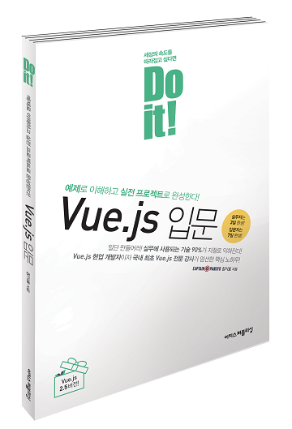
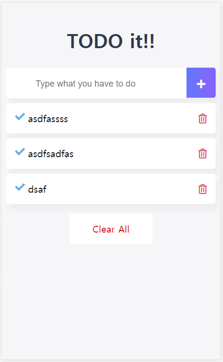

Do it! Vue.js 입문 Todo App 따라 만들어보기
==========================================
<br>

# vue-todo

> Vue.js에 대해 공부해보기 위해 무작정 따라서 만들어본 Todo App 입니다.

## Build Setup

``` bash
# install dependencies
npm install

# serve with hot reload at localhost:8080
npm run dev

# build for production with minification
npm run build
```

For detailed explanation on how things work, consult the [docs for vue-loader](http://vuejs.github.io/vue-loader).

사용하면서 v-for를 사용하는 태그가 jstl에서 사용했던 <c:forEach>와 상당히 유사함을 느꼈습니다.<br>
언어라는 것이 다른 곳에서도 비슷하게 적용되어 사용되기 때문에 비교적 쉽게 학습이 가능하다는 것에 재미가 있었고, 화면 요소들을 손쉽게 제어하여 빠르게 렌더링할 수 있다는 점에서 vuejs에 상당한 매력을 느꼈습니다.
